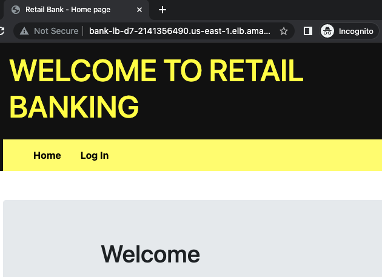

<p align="center">

</p>
<h1 align="center">C4_deployment-7<h1> 

# Purpose

This deployment demonstrates the containerization of a retail bank application using infrastructure as code to deploy a CI/CD pipeline management infrastructure and managed container services.

Terraform is used to deploy a Jenkins manager and agent architecture using AWS cloud infrastructure. The Jenkins infrastructure leverages Terraform to deploy a VPC and resources, configure AWS ECS, and deploy a container image of the retail bank application. Once online, the application can make a connection the RDS MySQL database service.

## Deployment Files:

The following files are needed to run this deployment:

- `app.py` The main python application file
- `database.py` Python file to create application database
- `load_data.py` Python file to load data into into the database
- `test_app.py` Test functions used to test application functionality
- `requirements.txt` Required packages for python application
- `jenkins_server.sh` Bash script to install and run Jenkins
- `Jenkinsfile` Configuration file used by Jenkins to run a pipeline
- `README.md` README documentation
- `static/` Folder housing CSS files
- `templates/` Folder housing HTML templates
- `initTerraform/` Folder housing terraform files
- `initTerraform/main.tf` Terraform file to deploy AWS infrastructure
- `initTerraform/app_server_setup.sh` Bash script to install required packages for the app server

## `Steps`

1. This deployment centers around deploying a containerized application using the Docker engine. Here we will configure the Dockerfile to deploy the retail banking application. Dockerfile configuration: 

	```go
	FROM python:3.7

    RUN git clone https://github.com/kaedmond24/bank_app_deployment_6.git

    WORKDIR /bank_app_deployment_6

    RUN apt-get update
    RUN apt-get install -y build-essential
    RUN apt-get install -y default-libmysqlclient-dev
    RUN apt-get install -y python3-dev

    RUN pip install -r requirements.txt
    RUN pip install gunicorn
    RUN pip install mysqlclient

    EXPOSE 8000

    ENTRYPOINT ["python", "-m", "gunicorn", "app:app", "-b", "0.0.0.0"]
	```
<br><br>

2. The AWS Elastic Container Service (ECS) will be used to deploy our banking application. A few configuration changes need to be made to the initTerraform/main.tf file in order to successfully deploy our container. Updates to the following lines were added:

	```text
    Line 10 name = “bankapp-d7-cluster"
    Line 13 Project = "Deploy7"
    Line 28 family = "bank-task"
    Line 33 "name": "bank-container-d7",
    Line 34 "image": "kaedmond24/bankapp:latest",
    Line 45 "containerPort": 8000
    Line 56 execution_role_arn = "arn:aws:iam::063015932017:role/ecsTaskExecutionRolePolicy"
    Line 57 task_role_arn = "arn:aws:iam::063015932017:role/ecsTaskExecutionRolePolicy"
    Line 63 name = "bank-d7-l-ecs-service"
    Line 82 container_name = "bank-container-d7"
    Line 83 container_port = 8000
    ```

 <br><br>

3. The Jenkinsfile, used to direct the Jenkins pipeline build, requires a couple of changes before being used. We have to update the configuration using the following process:
	
	```bash
	git branch jnk_config
    git checkout jnk_config
    ```

    Modify Jenkinsfile

    ```text
    Line 4 DOCKERHUB_CREDENTIALS = credentials('kaedmond24-dockerhub')
    Line 31 sh 'docker build -t kaedmond24/bankapp11 .'
    Line 42 sh 'docker push kaedmond24/bankapp'
    ```

    ```bash
    git add Jenkinsfile
    git commit -m “Commit Message”
    git checkout main
    git merge jnk_config
    git push -u origin main
    ```

 <br><br>

4. The management infrastructure for our CI/CD pipeline consisting of a Jenkins server and agents architecture will be deployed to our default VPC using Terraform. A Jenkins management server, Jenkins agent IaC server, and Jenkins agent container server deployment can be initiated by running the following commands:

    ```bash
    Terraform init
    Terraform plan
    Terraform apply
    ```

    Use terraform output to retrieve public IP info for the management infrastructure.

    ```text
    Apply complete! Resources: 3 added, 0 changed, 0 destroyed.

    Outputs:

    jenkins_management_server_public_ip = "3.90.249.4"
    jnk_agent_container_server_public_ip = "184.72.92.216"
    jnk_agent_iac_server_public_ip = "35.172.117.29"
    ```

 <br><br>

5. Several items need to be configured on the Jenkins management server before deploying the application. For starters, verify that the Jenkins application is accessible at the jenkins_management_server_public_ip IP address returned by the terraform process..

    ```bash
    http://<jenkins_management_server>:8080
    ```

    Retrieve initial Jenkins password from the server terminal:

    ```bash
    sudo cat /var/lib/jenkins/secrets/initialAdminPassword
    ```
 
    Install `Docker Pipeline` plugin for Jenkins. This plugin allows Jenkins pipelines to use Docker images for building and testing. 

    - From the Dashboard, go to `Managed Jenkins` > `Plugins` > `Available plugins`
    - Search: `Docker Pipeline` > `Check box` > `Install`
    - Verify installation under `Installed plugins`

    Setup two Jenkins node agents to facilitate an ssh connection between the Jenkins management server and the Jenkins agent IaC and Jenkins agent container servers. These agent servers allow Jenkins to offload pipeline jobs in an effort to optimize the deployment process. Configure the node agent by navigating to `Dashboard` > `Build Executor Status` > `New Node`:

    - Node name: `awsDeploy`
    - Select `Permanent Agent`
    - Number of executors: `1`
    - Remote root directory: `/home/ubuntu/agent1`
    - Labels: `awsDeploy`
    - Usage: `Only build jobs with label expressions matching this node`
    - Launch method: `Launch agents via SSH`
    - Host: `<jnk_agent_iac_server_public_ip>`
    - Credentials: `ubuntu`
    - Host Key Verification Strategy: `Non verifying Verification Strategy`
    - Availability: `Keep this agent online as much as possible`
    - `SAVE`

    Create another Node:

    - Node name: `awsDeploy2`
    - Select `Permanent Agent`
    - Number of executors: `1`
    - Remote root directory: `/home/ubuntu/agent1`
    - Labels: `awsDeploy`
    - Usage: `Only build jobs with label expressions matching this node`
    - Launch method: `Launch agents via SSH`
    - Host: `<jnk_agent_container_server_public_ip>`
    - Credentials: `ubuntu`
    - Host Key Verification Strategy: `Non verifying Verification Strategy`
    - Availability: `Keep this agent online as much as possible`
    - `SAVE

    Agents will be available a few minutes after saving. 

    Setup credentials for AWS (used by Terraform) and Dockerhub which will be required by the Jnk agent iac Jnk agent container servers, respectively. Configure the credentials by navigating to `Dashboard` > `Manage Jenkins` > `Credentials` > `System (Credentials)` > `Global credentials` > `Add Credentials`:

    - Kind: `Secret Text`
    - Scope `Global`
    - Secret:: `**AWS Access Key**`
    - ID: `AWS_ACCESS_KEY`
    - Description: `aws access key`
    - `Create`

    Repeat `Add Credentials` for AWS Secret Key

    - Kind: `Secret Text`
    - Scope `Global`
    - Secret: `**AWS Secret Key**`
    - ID: `AWS_SECRET_KEY`
    - Description: `aws access key`
    - `Create`

    Repeat `Add Credentials` for Dockerhub

    - Kind: `Username with password`
    - Scope `Global`
    - Username `kaedmond24`
    - Password `Dockerhub Access Token`
    - ID: `kaedmond24-dockerhub`
    - `Create`

    Setup Jenkins build pipeline:

    - From Dashboard, select a `new item` > `Create Name` > `Mulit-branch Pipeline` option
    - Set Branch sources:
        * Credentials: [How to setup Github Access Token](https://docs.github.com/en/enterprise-server@3.8/authentication/keeping-your-account-and-data-secure/managing-your-personal-access-tokens)
        * Repository HTTPS URL: `<Github Repo URL>`
        * Build Configuration > Mode > Script Path: Jenkinsfile
    - `Apply` and `Save`

    Run build pipeline.

    The result of a successful Jenkins pipeline run will produce a DNS address to access the application.

	```text
    Apply complete! Resources: 1 added, 1 changed, 1 destroyed.
    [0m[0m[1m[32m
    Outputs:

    [0malb_url = "http://bank-lb-d7-2141356490.us-east-1.elb.amazonaws.com"
    ```

<br><br>

6. Here is an overview of the bank application infrastructure. Terraform is used during the Jenkins pipeline's `Apply` phase to create a VPC with the following network resources two public subnets, two private subnets, a nat gateway with an elastic IP, one public and private route table, and an Internet gateway byway of the vpc.tf file. The next layer of the application infrastructure is the AWS ECS service configuration building upon the newly created VPC using the main.tf file. Deployment of the AWS ECS containers includes setting up a cluster with a service and task definition instructed to deploy two containers, one in each private subnet and a cloud watch log group. Finally, an application load balancer is created from the alb.tf Terraform file. In addition to the application load balancer (alb), an alb listener and target group configured to develop a central access point for the bank application. Once Terraform completes the deployment, the bank application will become accessible using this link `http://bank-lb-d7-2141356490.us-east-1.elb.amazonaws.com`.<br>

    <br>

<br><br>

## `System Diagram`

CI/CD Pipeline Architecture [Link](c4_deployment_7.png)

## `Issues`

`Error`: TBA

`Solution`: TBA


## `Optimization`

1. `Is your infrastructure secure?` `if yes or no, why?`
    ```text
    In its current state, the infrastructure is not fully secure. The application is open to the Internet without any front-end protection. A DDoS attack could cause the application to become inaccessible. Adding a web application firewall (WAF) service or using CloudFront can add a layer of protection. CloudFront comes with limited WAF capabilities built-in. Also, the RDS database is publicly available, increasing its vulnerability to outside attacks.
    ```

2. `What happens when you terminate 1 instance? Is this infrastructure fault-tolerant?`
    ```text
	The management infrastructure does not have any fault-tolerance setup. Therefore, if an instance gets deleted, it will not be automatically replaced. On the other hand, the container infrastructure has fault tolerance built in due to its task configuration. If a container gets terminated, a new container will be created as its replacement.
    ```

3. `Which subnet were the containers deployed in?`
    ```text
	The containers were deployed to the private subnets, private us-east-1a, and private us-east-1b. One container is scheduled to run in each private subnet.
    ```